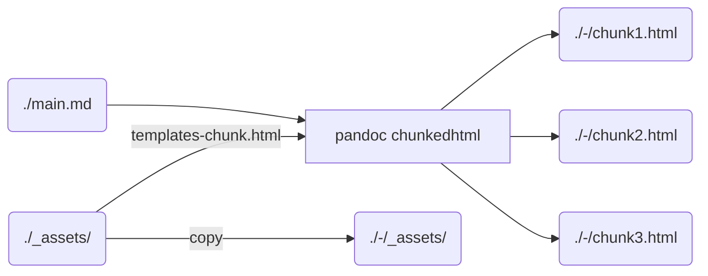

# ssphd

An attempt to single-source a PhD manuscript.

Learn more about Single-Source Publishing (SSP) [here](https://coko.foundation/articles/single-source-publishing.html).

## Output format support

| Limited functionality | Full functionality |
| --------------------- | ------------------ |
| `html`                |                    |
| `latex`               |                    |

## Getting started

### Installation

- **Pandoc**

  refer to https://github.com/jgm/pandoc/blob/main/INSTALL.md.

- **Haskell and stuff** (for pandoc filters)

  install ghcup: https://www.haskell.org/ghcup/.
  
  ```bash
   ghcup install ghc
   ghcup install cabal
   cabal v2-update
  ```

- **Pandoc filters**
  - pandoc-sidenote
    
    ```bash
    cabal v2-install pandoc-sidenote
    ```

  - pandoc-crossref

    ```bash
    cabal v2-install --install-method=copy pandoc-cli pandoc-crossref
    ```

    for Windows users, you might need to put pandoc-crossref (`C:/cabal/bin/pandoc-crossref.exe`) manually to the PATH.

- **Python packages**
  
    ```bash
    pip install -r requirements.txt
    ```

### Usage

Create your `main.md`, using our [extended syntax of Pandoc markdown](./syntax.md).

To produce the output(s), run

```bash
python ./build.py main.md
```

This will produce a bunch of folders, like `main-html`, `main-latex` which contain the outputs.

## Workflow



## Roadmap

### Core features

- add modularity (let the user enable/disable features)
- package this and resolve dependencies

### New output formats support

- `docx`
- `latex`
- `JATS`

### Functionalities

- 3D objects visualization
- Units conversion (like in ciechanow.ski exquisite articles)
- More granular search (search over figures, graphs, data, bibliographic references)

### Aesthetics

- make this themable
- implement native dark/light modes
- do real work on 

## Contributing