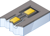

# This is the first section (chapter), which has a very long and complicated name. What will happen?

# This is new {-}

abc

## Hello {-}

hii

### Yoooop  {-}

bounce

Lorem ipsum dolor sit amet, consectetur adipiscing elit, sed do eiusmod tempor incididunt ut labore et dolore magna aliqua. Eget lorem dolor sed viverra ipsum nunc aliquet bibendum enim. Felis imperdiet proin fermentum leo vel orci porta non pulvinar. Phasellus egestas tellus rutrum tellus pellentesque eu tincidunt tortor. Congue eu consequat ac felis donec et odio pellentesque diam. Sit amet nulla facilisi morbi tempus iaculis urna id. Eget dolor morbi non arcu risus. Nulla facilisi etiam dignissim diam quis enim lobortis. Mattis ullamcorper velit sed ullamcorper. Diam volutpat commodo sed egestas egestas fringilla phasellus. Non nisi est sit amet facilisis. Lorem ipsum dolor sit amet, consectetur adipiscing elit, sed do eiusmod tempor incididunt ut labore et dolore magna aliqua. Eget lorem dolor sed viverra ipsum nunc aliquet bibendum enim. Felis imperdiet proin fermentum leo vel orci porta non pulvinar. Phasellus egestas tellus rutrum tellus pellentesque eu tincidunt tortor. Congue eu consequat ac felis donec et odio pellentesque diam. Sit amet nulla facilisi morbi tempus iaculis urna id. Eget dolor morbi non arcu risus. Nulla facilisi etiam dignissim diam quis enim lobortis. Mattis ullamcorper velit sed ullamcorper. Diam volutpat commodo sed egestas egestas fringilla phasellus. Non nisi est sit amet facilisis. Lorem ipsum dolor sit amet, consectetur adipiscing elit, sed do eiusmod tempor incididunt ut labore et dolore magna aliqua. Eget lorem dolor sed viverra ipsum nunc aliquet bibendum enim. Felis imperdiet proin fermentum leo vel orci porta non pulvinar. Phasellus egestas tellus rutrum tellus pellentesque eu tincidunt tortor. Congue eu consequat ac felis donec et odio pellentesque diam. Sit amet nulla facilisi morbi tempus iaculis urna id. Eget dolor morbi non arcu risus. Nulla facilisi etiam dignissim diam quis enim lobortis. Mattis ullamcorper velit sed ullamcorper. Diam volutpat commodo sed egestas egestas fringilla phasellus. Non nisi est sit amet facilisis.


### Yoooopla {-}

chickiddy

### Dis is another h3 {-}

chickiddy

#### Dis is h4 {-}

:smile: Lorem "ipsum" H~2~O **dolor** sit amet, *consectetur* adipiscing elit, sed do eiusmod tempor incididunt ut labore et dolore magna aliqua. Eget lorem dolor sed viverra ipsum nunc aliquet bibendum enim. Felis imperdiet proin fermentum leo vel orci porta non pulvinar. Phasellus egestas tellus rutrum tellus pellentesque eu tincidunt tortor. Congue eu consequat ac felis donec et odio pellentesque diam. Sit amet nulla facilisi morbi tempus iaculis urna id. Eget dolor morbi non arcu risus. Nulla facilisi etiam dignissim diam quis enim lobortis. Mattis ullamcorper velit sed ullamcorper. Diam volutpat commodo sed egestas egestas fringilla phasellus. Non nisi est sit amet facilisis.

# Introduction {-}

:smile: Lorem "ipsum" H~2~O **dolor** sit amet, *consectetur* adipiscing elit, sed do eiusmod tempor incididunt ut labore et dolore magna aliqua. Eget lorem dolor sed viverra ipsum nunc aliquet bibendum enim. Felis imperdiet proin fermentum leo vel orci porta non pulvinar. Phasellus egestas tellus rutrum tellus pellentesque eu tincidunt tortor. Congue eu consequat ac felis donec et odio pellentesque diam. Sit amet nulla facilisi morbi tempus iaculis urna id. Eget dolor morbi non arcu risus. Nulla facilisi etiam dignissim diam quis enim lobortis. Mattis ullamcorper velit sed ullamcorper. Diam volutpat commodo sed egestas egestas fringilla phasellus. Non nisi est sit amet facilisis.

Lorem ipsum dolor sit amet, consectetur adipiscing elit, sed do eiusmod tempor incididunt ut labore et dolore magna aliqua. Eget lorem dolor sed viverra ipsum nunc aliquet bibendum enim. Felis imperdiet proin fermentum leo vel orci porta non pulvinar. Phasellus egestas tellus rutrum tellus pellentesque eu tincidunt tortor. Congue eu consequat ac felis donec et odio pellentesque diam. Sit amet nulla facilisi morbi tempus iaculis urna id. Eget dolor morbi non arcu risus. Nulla facilisi etiam dignissim diam quis enim lobortis. Mattis ullamcorper velit sed ullamcorper. Diam volutpat commodo sed egestas egestas fringilla phasellus. Non nisi est sit amet facilisis. Lorem ipsum dolor sit amet, consectetur adipiscing elit, sed do eiusmod tempor incididunt ut labore et dolore magna aliqua. Eget lorem dolor sed viverra ipsum nunc aliquet bibendum enim. Felis imperdiet proin fermentum leo vel orci porta non pulvinar. Phasellus egestas tellus rutrum tellus pellentesque eu tincidunt tortor. Congue eu consequat ac felis donec et odio pellentesque diam. Sit amet nulla facilisi morbi tempus iaculis urna id. Eget dolor morbi non arcu risus. Nulla facilisi etiam dignissim diam quis enim lobortis. Mattis ullamcorper velit sed ullamcorper. Diam volutpat commodo sed egestas egestas fringilla phasellus. Non nisi est sit amet facilisis. Lorem ipsum dolor sit amet, consectetur adipiscing elit, sed do eiusmod tempor incididunt ut labore et dolore magna aliqua. Eget lorem dolor sed viverra ipsum nunc aliquet bibendum enim. Felis imperdiet proin fermentum leo vel orci porta non pulvinar. Phasellus egestas tellus rutrum tellus pellentesque eu tincidunt tortor. Congue eu consequat ac felis donec et odio pellentesque diam. Sit amet nulla facilisi morbi tempus iaculis urna id. Eget dolor morbi non arcu risus. Nulla facilisi etiam dignissim diam quis enim lobortis. Mattis ullamcorper velit sed ullamcorper. Diam volutpat commodo sed egestas egestas fringilla phasellus. Non nisi est sit amet facilisis.

# Markdown Kitchen Sink
This file is <https://github.com/adam-p/markdown-here/wiki/Markdown-Cheatsheet> plus a few fixes and additions. Used by [obedm503/bootmark](https://github.com/obedm503/bootmark) to [demonstrate](https://obedm503.github.io/bootmark/docs/markdown-cheatsheet.html) it's styling features.

This is intended as a quick reference and showcase. For more complete info, see [John Gruber's original spec](http://daringfireball.net/projects/markdown/) and the [Github-flavored Markdown info page](http://github.github.com/github-flavored-markdown/).

Note that there is also a [Cheatsheet specific to Markdown Here](./Markdown-Here-Cheatsheet) if that's what you're looking for. You can also check out [more Markdown tools](./Other-Markdown-Tools).

##### Table of Contents
[Headers](#headers)
[Emphasis](#emphasis)
[Lists](#lists)
[Links](#links)
[Images](#images)
[Code and Syntax Highlighting](#code)
[Tables](#tables)
[Blockquotes](#blockquotes)
[Inline HTML](#html)
[Horizontal Rule](#hr)
[Line Breaks](#lines)
[YouTube Videos](#videos)

<a name="headers"></a>

## Headers

```markdown
# H1
## H2
### H3
#### H4
##### H5
###### H6

Alternatively, for H1 and H2, an underline-ish style:

Alt-H1
======

Alt-H2
------
```

# H1
## H2
### H3
#### H4
##### H5
###### H6

Alternatively, for H1 and H2, an underline-ish style:

Alt-H1
======

Alt-H2
------

<a name="emphasis"></a>

## Emphasis

```md
Emphasis, aka italics, with *asterisks* or _underscores_.

Strong emphasis, aka bold, with **asterisks** or __underscores__.

Combined emphasis with **asterisks and _underscores_**.

Strikethrough uses two tildes. ~~Scratch this.~~
```

Emphasis, aka italics, with *asterisks* or _underscores_.

Strong emphasis, aka bold, with **asterisks** or __underscores__.

Combined emphasis with **asterisks and _underscores_**.

Strikethrough uses two tildes. ~~Scratch this.~~


<a name="lists"></a>

## Lists

(In this example, leading and trailing spaces are shown with with dots: `⋅`)

```no-highlight
1. First ordered list item
2. Another item
⋅⋅* Unordered sub-list.
1. Actual numbers don't matter, just that it's a number
⋅⋅1. Ordered sub-list
4. And another item.

⋅⋅⋅You can have properly indented paragraphs within list items. Notice the blank line above, and the leading spaces (at least one, but we'll use three here to also align the raw Markdown).

⋅⋅⋅To have a line break without a paragraph, you will need to use two trailing spaces.⋅⋅
⋅⋅⋅Note that this line is separate, but within the same paragraph.⋅⋅
⋅⋅⋅(This is contrary to the typical GFM line break behaviour, where trailing spaces are not required.)

* Unordered list can use asterisks
- Or minuses
+ Or pluses
```
****
1. First ordered list item
2. Another item
   * Unordered sub-list.
3. Actual numbers don't matter, just that it's a number
   1. Ordered sub-list
4. And another item.

   You can have properly indented paragraphs within list items. Notice the blank line above, and the leading spaces (at least one, but we'll use three here to also align the raw Markdown).

   To have a line break without a paragraph, you will need to use two trailing spaces.
   Note that this line is separate, but within the same paragraph.
   (This is contrary to the typical GFM line break behaviour, where trailing spaces are not required.)

* Unordered list can use asterisks
- Or minuses
+ Or pluses

<a name="links"></a>

## Links

There are two ways to create links.

```no-highlight
[I'm an inline-style link](https://www.google.com)

[I'm an inline-style link with title](https://www.google.com "Google's Homepage")

[I'm a reference-style link][Arbitrary case-insensitive reference text]

[I'm a relative reference to a repository file](../blob/master/LICENSE)

[You can use numbers for reference-style link definitions][1]

Or leave it empty and use the [link text itself].

URLs and URLs in angle brackets will automatically get turned into links.
http://www.example.com or <http://www.example.com> and sometimes
example.com (but not on Github, for example).

Some text to show that the reference links can follow later.

[arbitrary case-insensitive reference text]: https://www.mozilla.org
[1]: http://slashdot.org
[link text itself]: http://www.reddit.com
```

[I'm an inline-style link](https://www.google.com)

[I'm an inline-style link with title](https://www.google.com "Google's Homepage")

[I'm a reference-style link][Arbitrary case-insensitive reference text]

[I'm a relative reference to a repository file](../blob/master/LICENSE)

[You can use numbers for reference-style link definitions][1]

Or leave it empty and use the [link text itself].

URLs and URLs in angle brackets will automatically get turned into links.
http://www.example.com or <http://www.example.com> and sometimes
example.com (but not on Github, for example).

Some text to show that the reference links can follow later.

[arbitrary case-insensitive reference text]: https://www.mozilla.org
[1]: http://slashdot.org
[link text itself]: http://www.reddit.com

<a name="images"></a>

## Images

```no-highlight
Here's our logo (hover to see the title text):

Inline-style:


Reference-style:
![alt text][logo]

[logo]: https://github.com/adam-p/markdown-here/raw/master/src/common/images/icon48.png "Logo Title Text 2"
```

Here's our logo (hover to see the title text):

Inline-style:


Reference-style:
![alt text][logo]

[logo]: https://github.com/adam-p/markdown-here/raw/master/src/common/images/icon48.png "Logo Title Text 2"

<a name="code"></a>

## Code and Syntax Highlighting

Code blocks are part of the Markdown spec, but syntax highlighting isn't. However, many renderers -- like Github's and *Markdown Here* -- support syntax highlighting. Which languages are supported and how those language names should be written will vary from renderer to renderer. *Markdown Here* supports highlighting for dozens of languages (and not-really-languages, like diffs and HTTP headers); to see the complete list, and how to write the language names, see the [highlight.js demo page](http://softwaremaniacs.org/media/soft/highlight/test.html).

```no-highlight
Inline `code` has `back-ticks around` it.
```

Inline `code` has `back-ticks around` it.

Blocks of code are either fenced by lines with three back-ticks <code>```</code>, or are indented with four spaces. I recommend only using the fenced code blocks -- they're easier and only they support syntax highlighting.

~~~markdown
```javascript
var s = "JavaScript syntax highlighting";
alert(s);
```

```python
s = "Python syntax highlighting"
print s
```

```{.numberLines}
No language indicated, so no syntax highlighting. But the lines are numbered!
But let's throw in a &lt;b&gt;tag&lt;/b&gt;.
```
~~~

```javascript
var s = "JavaScript syntax highlighting";
alert(s);
```

```python
s = "Python syntax highlighting"
print s
```

```{.numberLines}
No language indicated, so no syntax highlighting. But the lines are numbered!
But let's throw in a <b>tag</b>.
```


<a name="tables"></a>

## Tables

Tables aren't part of the core Markdown spec, but they are part of GFM and *Markdown Here* supports them. They are an easy way of adding tables to your email -- a task that would otherwise require copy-pasting from another application.

```no-highlight
Colons can be used to align columns.

| Tables        | Are           | Cool  |
| ------------- |:-------------:| -----:|
| col 3 is      | right-aligned | $1600 |
| col 2 is      | centered      |   $12 |
| zebra stripes | are neat      |    $1 |

There must be at least 3 dashes separating each header cell.
The outer pipes (|) are optional, and you don't need to make the
raw Markdown line up prettily. You can also use inline Markdown.

Markdown | Less | Pretty
--- | --- | ---
*Still* | `renders` | **nicely**
1 | 2 | 3
```

Colons can be used to align columns.

| Tables        | Are           | Cool |
| ------------- |:-------------:| -----:|
| col 3 is      | right-aligned | $1600 |
| col 2 is      | centered      |   $12 |
| zebra stripes | are neat      |    $1 |

There must be at least 3 dashes separating each header cell. The outer pipes (|) are optional, and you don't need to make the raw Markdown line up prettily. You can also use inline Markdown.

Markdown | Less | Pretty
--- | --- | ---
*Still* | `renders` | **nicely**
1 | 2 | 3

<a name="blockquotes"></a>

## Blockquotes

```no-highlight
> Blockquotes are very handy in email to emulate reply text.
> This line is part of the same quote.

Quote break.

> This is a very long line that will still be quoted properly when it wraps. Oh boy let's keep writing to make sure this is long enough to actually wrap for everyone. Oh, you can *put* **Markdown** into a blockquote.
```

> Blockquotes are very handy in email to emulate reply text.
> This line is part of the same quote.

Quote break.

> This is a very long line that will still be quoted properly when it wraps. Oh boy let's keep writing to make sure this is long enough to actually wrap for everyone. Oh, you can *put* **Markdown** into a blockquote.

<a name="html"></a>

## Inline HTML

You can also use raw HTML in your Markdown, and it'll mostly work pretty well.

```html
<dl>
  <dt>Definition list</dt>
  <dd>Is something people use sometimes.</dd>

  <dt>Markdown in HTML</dt>
  <dd>Does *not* work **very** well. Use HTML <em>tags</em>.</dd>
</dl>
```

<dl>
  <dt>Definition list</dt>
  <dd>Is something people use sometimes.</dd>

  <dt>Markdown in HTML</dt>
  <dd>Does *not* work **very** well. Use HTML <em>tags</em>.</dd>
</dl>

<a name="hr"></a>

## Horizontal Rule

```
Three or more...

---

Hyphens

***

Asterisks

___

Underscores
```

Three or more...

---

Hyphens

***

Asterisks

___

Underscores

<a name="lines"></a>

## Line Breaks

My basic recommendation for learning how line breaks work is to experiment and discover -- hit &lt;Enter&gt; once (i.e., insert one newline), then hit it twice (i.e., insert two newlines), see what happens. You'll soon learn to get what you want. "Markdown Toggle" is your friend.

Here are some things to try out:

```
Here's a line for us to start with.

This line is separated from the one above by two newlines, so it will be a *separate paragraph*.

This line is also a separate paragraph, but...\
This line is only separated by a single newline, so it's a separate line in the *same paragraph*.
```

Here's a line for us to start with.

This line is separated from the one above by two newlines, so it will be a *separate paragraph*.

This line is also begins a separate paragraph, but...\
This line is only separated by a single newline, so it's a separate line in the *same paragraph*.

(Technical note: *Markdown Here* uses GFM line breaks, so there's no need to use MD's two-space line breaks.)

<a name="videos"></a>

## YouTube Videos

They can't be added directly but you can add an image with a link to the video like this:

```no-highlight
<a href="http://www.youtube.com/watch?feature=player_embedded&v=YOUTUBE_VIDEO_ID_HERE
" target="_blank"></a>
```

Or, in pure Markdown, but losing the image sizing and border:

```no-highlight
[](http://www.youtube.com/watch?v=YOUTUBE_VIDEO_ID_HERE)
```

# Definition lists

Term 1

:   Definition 1

Term 2 with *inline markup*

:   Definition 2

        { some code, part of Definition 2 }

    Third paragraph of definition 2.


# Graphics

## Graphs

### Dygraphs

<div class="plot-container">
  <div class="graph" id="graph-1">
  </div>
  <div class="graph" id="graph-2">
  </div>
</div>
<script src="_assets/graphs/graph1.js" ></script>

{#fig:custom1}

---

#### What I want to have in the `.md` source {-}

Two cases:

1. Short-form : input labeled data only w/ a link to a `data.csv` this shape:

    Data1 (unit)  Data2   Data3        Data4
    ------------  ------  ----------   -------
    12            12      2            12
    23            123     123          123
    1             1       1            1


    And have the following syntax for a quick graph ([@fig:graph1; @fig:test_svg]):

    ```markdown
    {#fig:graph1 x="Data1 (unit)" y="Data2, Data3"}
    ```

    A filter would recognize the file format as `.csv`, and would process the thing to create a javascript Dygraph object that links to a div, enclosd in a figure with the corresponding caption.

    **TEST:**

    {#fig:graph1 x="Data1 (unit)" y="Data2, Data3" xlabel="Légende X" ylabel="Légende Y"}

    In the margin :

    {#fig:graphmargin xlabel="Légende X" ylabel="Légende Y" legendPosition="caption"}


2. Long-form : let the user to write the `graph.js` script all by themselves.


## +[SVG] images

+[SVG]: Standard Vector Graphics

{#fig:test_svg width="80%"}

## Margin figures

{#fig:figmargin .margin}

## Subfigures

With `<div>` syntax:

<div id="fig:figureRef">
![subfigure 1 caption +[SVG]](_assets/pics/usa-census.png){#fig:figureRefA}

{#fig:figureRefB}

Caption of figure
</div>

With `::: {#fig:figureRef}` syntax (and in line):

::: {#fig:figureRef2}
{#fig:figureRef2A}
{#fig:figureRef2B}

Caption of figure
:::

Grid:

:::{#fig:coolfig}
{#fig:cfa}
{#fig:cfb}
{#fig:cfc}

{#fig:cfd}
{#fig:cfe}
{#fig:cff}

Cool figure!
:::

Grid 2 :

:::{#fig:grid2 .wide}
{#fig:cfa}
{#fig:cfb}
{#fig:cfc}
{#fig:cfd}

{#fig:cfe}
{#fig:cff}
{#fig:cfg}

Cool figure!
:::

:::{#fig:widefig .wide}
{#fig:cfa}
{#fig:cfb}
{#fig:cfc}

{#fig:cfd}
{#fig:cfe}
{#fig:cff}

Wide figure!
:::

Regular figure :

{#fig:regular}


# Cross-links with `pandoc-crossref`

Regardez la [@sec:section-after-references].

[L'équation @eq:example est assez stock]

[@Eq:example; @eq:conservation]

Regarde [l'équation de continuité @eq:conservation]

Le @tbl:example

La @fig:test-graph

Check @fig:figureRef2B

# Citations

1. nobrackets @almogThermalStabilityThin2021

2. brackets [@almogThermalStabilityThin2021]

3. brackets [@mauriceDesignMicrofabricationCharacterization2016]

4. nobrackets : this text is taken from Talbi. @talbiMicroscaleHotWire2015

Citations list [@arwatzDynamicCalibrationModeling2013; @comte-bellotHotWireAnemometry1976; @cahillThermalConductivityMeasurement1990] (not working --only with semicolons ?)

Authors in-text: @fanLowdimensionalSiCNanostructures2006; @pisanoBridgeConceptualFrameworks2015, @ummelsStochasticMultiplayerGames2010

With page locator: [@talbiMicroscaleHotWire2015, p. 8].

With locator and suffix: [@talbiMicroscaleHotWire2015, pp. 33-35 and *passim*].

With chapter locator [@talbiMicroscaleHotWire2015, chap. 1].

With chapter locator and prefix [see @talbiMicroscaleHotWire2015, chap. 1].

Lorem ipsum dolor sit amet, consectetur adipiscing elit, sed do eiusmod tempor incididunt ut labore et dolore magna aliqua. Eget lorem dolor sed viverra ipsum nunc aliquet bibendum enim. Felis [@baarMicromachinedStructuresThermal2001] imperdiet proin fermentum leo vel orci porta non pulvinar. Phasellus egestas tellus rutrum tellus pellentesque eu tincidunt tortor. Congue eu consequat ac felis donec et odio pellentesque diam. Sit amet nulla facilisi [@balakrishnanHighlySensitive3CSiC2018] morbi tempus iaculis urna id. Eget dolor morbi non arcu risus. Nulla facilisi etiam dignissim diam quis enim lobortis. Mattis ullamcorper velit sed ullamcorper. Diam volutpat commodo sed egestas egestas fringilla phasellus. Non nisi est sit amet facilisis.


Lorem ipsum dolor sit amet, consectetur adipiscing elit, sed do eiusmod tempor incididunt ut labore et dolore magna aliqua. Eget lorem dolor sed viverra ipsum nunc bibendum enim. Felis imperdiet proin fermentum leo vel orci porta non pulvinar. Phasellus egestas tellus rutrum tellus [@balakrishnanHotfilmAirFlow2019] pellentesque eu tincidunt tortor. Congue eu consequat ac felis donec et odio pellentesque diam. Sit amet nulla facilisi morbi tempus iaculis urna id. Eget dolor morbi non arcu risus. Nulla facilisi etiam dignissim diam quis enim lobortis. Mattis ullamcorper velit sed ullamcorper. Diam [@buderAeroMEMSPolyimideBased2008] volutpat commodo sed egestas egestas fringilla phasellus. Non nisi est sit amet facilisis.


[@chandrasekharanMicroscaleDifferentialCapacitive2011] Lorem ipsum dolor sit amet, consectetur adipiscing elit, sed do eiusmod tempor incididunt ut labore et dolore magna aliqua. Eget lorem dolor sed viverra ipsum nunc aliquet bibendum enim. Felis imperdiet proin [@dinhApplicationsThermoelectricalEffect2018] fermentum leo vel orci porta non pulvinar. Phasellus egestas tellus rutrum tellus pellentesque eu tincidunt tortor. Congue eu consequat ac felis donec et odio pellentesque diam. Sit amet nulla [@chenInstrumentationGradeShearStress2016] facilisi [@dinhOnChipSiCMEMS2018] morbi tempus iaculis urna id. Eget dolor morbi non arcu risus. Nulla facilisi etiam dignissim diam quis [@flemishDryEtchingSiC1996] enim lobortis. Mattis ullamcorper velit sed ullamcorper. Diam volutpat commodo sed egestas egestas fringilla phasellus. Non nisi est sit amet facilisis.

Lorem ipsum dolor [@ghouila-houriHighTemperatureGradient2021] sit amet, [@gimenoSyntheticJetsBased2010] consectetur adipiscing elit, sed do eiusmod tempor incididunt ut labore et dolore magna aliqua. Eget lorem dolor sed viverra ipsum nunc aliquet bibendum enim. Felis imperdiet [@hoMicroElectroMechanicalSystemsMemsFluid1998] proin fermentum leo vel orci porta non pulvinar. Phasellus egestas tellus rutrum tellus pellentesque eu tincidunt tortor. Congue eu consequat ac felis @gerlachGoldSiliconPhase1967 donec et odio pellentesque diam. Sit amet nulla facilisi morbi tempus iaculis urna id. Eget dolor morbi non @hourlierThermalDecompositionCalcium2019 arcu risus. Nulla facilisi etiam dignissim diam quis enim lobortis. Mattis ullamcorper velit sed ullamcorper. Diam volutpat commodo sed egestas egestas fringilla phasellus. [@jiangMicromachinedPolysiliconHotWire1994] Non nisi est sit [@weiHighlySensitiveDiodeBased2019] amet facilisis.

# Numbered chapter

Lorem ipsum dolor sit amet, consectetur adipiscing elit, sed do eiusmod tempor incididunt ut labore et dolore magna aliqua. Eget lorem dolor sed viverra ipsum nunc aliquet bibendum enim. Felis imperdiet proin fermentum leo vel orci porta non pulvinar. Phasellus egestas tellus rutrum tellus pellentesque eu tincidunt tortor. Congue eu consequat ac felis donec et odio pellentesque diam. Sit amet nulla facilisi morbi tempus iaculis urna id. Eget dolor morbi non arcu risus. Nulla facilisi etiam dignissim diam quis enim lobortis. Mattis ullamcorper velit sed ullamcorper. Diam volutpat commodo sed egestas egestas fringilla phasellus. Non nisi est sit amet facilisis.

## Section

Lorem ipsum dolor sit amet, consectetur adipiscing elit, sed do eiusmod tempor incididunt ut labore et dolore magna aliqua. Eget lorem dolor sed viverra ipsum nunc aliquet bibendum enim. Felis imperdiet proin fermentum leo vel orci porta non pulvinar. Phasellus egestas tellus rutrum tellus pellentesque eu tincidunt tortor. Congue eu consequat ac felis donec et odio pellentesque diam. Sit amet nulla facilisi morbi tempus iaculis urna id. Eget dolor morbi non arcu risus. Nulla facilisi etiam dignissim diam quis enim lobortis. Mattis ullamcorper velit sed ullamcorper. Diam volutpat commodo sed egestas egestas fringilla phasellus. Non nisi est sit amet facilisis. Lorem ipsum dolor sit amet, consectetur adipiscing elit, sed do eiusmod tempor incididunt ut labore et dolore magna aliqua. Eget lorem dolor sed viverra ipsum nunc aliquet bibendum enim. Felis imperdiet proin fermentum leo vel orci porta non pulvinar. Phasellus egestas tellus rutrum tellus pellentesque eu tincidunt tortor. Congue eu consequat ac felis donec et odio pellentesque diam. Sit amet nulla facilisi morbi tempus iaculis urna id. Eget dolor morbi non arcu risus. Nulla facilisi etiam dignissim diam quis enim lobortis. Mattis ullamcorper velit sed ullamcorper. Diam volutpat commodo sed egestas egestas fringilla phasellus. Non nisi est sit amet facilisis. Lorem ipsum dolor sit amet, consectetur adipiscing elit, sed do eiusmod tempor incididunt ut labore et dolore magna aliqua. Eget lorem dolor sed viverra ipsum nunc aliquet bibendum enim. Felis imperdiet proin fermentum leo vel orci porta non pulvinar. Phasellus egestas tellus rutrum tellus pellentesque eu tincidunt tortor. Congue eu consequat ac felis donec et odio pellentesque diam. Sit amet nulla facilisi morbi tempus iaculis urna id. Eget dolor morbi non arcu risus. Nulla facilisi etiam dignissim diam quis enim lobortis. Mattis ullamcorper velit sed ullamcorper. Diam volutpat commodo sed egestas egestas fringilla phasellus. Non nisi est sit amet facilisis. Lorem ipsum dolor sit amet, consectetur adipiscing elit, sed do eiusmod tempor incididunt ut labore et dolore magna aliqua. Eget lorem dolor sed viverra ipsum nunc aliquet bibendum enim. Felis imperdiet proin fermentum leo vel orci porta non pulvinar. Phasellus egestas tellus rutrum tellus pellentesque eu tincidunt tortor. Congue eu consequat ac felis donec et odio pellentesque diam. Sit amet nulla facilisi morbi tempus iaculis urna id. Eget dolor morbi non arcu risus. Nulla facilisi etiam dignissim diam quis enim lobortis. Mattis ullamcorper velit sed ullamcorper. Diam volutpat commodo sed egestas egestas fringilla phasellus. Non nisi est sit amet facilisis.

### Subsection

Lorem ipsum dolor sit amet, consectetur adipiscing elit, sed do eiusmod tempor incididunt ut labore et dolore magna aliqua. Eget lorem dolor sed viverra ipsum nunc aliquet bibendum enim. Felis imperdiet proin fermentum leo vel orci porta non pulvinar. Phasellus egestas tellus rutrum tellus pellentesque eu tincidunt tortor. Congue eu consequat ac felis donec et odio pellentesque diam. Sit amet nulla facilisi morbi tempus iaculis urna id.

#### Subsubsection

Eget dolor morbi non arcu risus. Nulla facilisi etiam dignissim diam quis enim lobortis. Mattis ullamcorper velit sed ullamcorper. Diam volutpat commodo sed egestas egestas fringilla phasellus. Non nisi est sit amet facilisis. Lorem ipsum dolor sit amet, consectetur adipiscing elit, sed do eiusmod tempor incididunt ut labore et dolore magna aliqua. Eget lorem dolor sed viverra ipsum nunc aliquet bibendum enim. Felis imperdiet proin fermentum leo vel orci porta non pulvinar. Phasellus egestas tellus rutrum tellus pellentesque eu tincidunt tortor. Congue eu consequat ac felis donec et odio pellentesque diam. Sit amet nulla facilisi morbi tempus iaculis urna id. Eget dolor morbi non arcu risus. Nulla facilisi etiam dignissim diam quis enim lobortis. Mattis ullamcorper velit sed ullamcorper. Diam volutpat commodo sed egestas egestas fringilla phasellus. Non nisi est sit amet facilisis. Lorem ipsum dolor sit amet, consectetur adipiscing elit, sed do eiusmod tempor incididunt ut labore et dolore magna aliqua. Eget lorem dolor sed viverra ipsum nunc aliquet bibendum enim. Felis imperdiet proin fermentum leo vel orci porta non pulvinar. Phasellus egestas tellus rutrum tellus pellentesque eu tincidunt tortor. Congue eu consequat ac felis donec et odio pellentesque diam. Sit amet nulla facilisi morbi tempus iaculis urna id. Eget dolor morbi non arcu risus. Nulla facilisi etiam dignissim diam quis enim lobortis. Mattis ullamcorper velit sed ullamcorper. Diam volutpat commodo sed egestas egestas fringilla phasellus. Non nisi est sit amet facilisis. Lorem ipsum dolor sit amet, consectetur adipiscing elit, sed do eiusmod tempor incididunt ut labore et dolore magna aliqua. Eget lorem dolor sed viverra ipsum nunc aliquet bibendum enim. Felis imperdiet proin fermentum leo vel orci porta non pulvinar.

### Subsection 2

Lorem ipsum dolor sit amet, consectetur adipiscing elit, sed do eiusmod tempor incididunt ut labore et dolore magna aliqua. Eget lorem dolor sed viverra ipsum nunc aliquet bibendum enim. Felis imperdiet proin fermentum leo vel orci porta non pulvinar. Phasellus egestas tellus rutrum tellus pellentesque eu tincidunt tortor. Congue eu consequat ac felis donec et odio pellentesque diam. Sit amet nulla facilisi morbi tempus iaculis urna id.

##### Level 5 heading

Phasellus egestas tellus rutrum tellus pellentesque eu tincidunt tortor. Congue eu consequat ac felis donec et odio pellentesque diam. Sit amet nulla facilisi morbi tempus iaculis urna id. Eget dolor morbi non arcu risus. Nulla facilisi etiam dignissim diam quis enim lobortis. Mattis ullamcorper velit sed ullamcorper. Diam volutpat commodo sed egestas egestas fringilla phasellus. Non nisi est sit amet facilisis.

###### Level 6 heading

### Subsection 3

Lorem ipsum dolor sit amet, consectetur adipiscing elit, sed do eiusmod tempor incididunt ut labore et dolore magna aliqua. Eget lorem dolor sed viverra ipsum nunc aliquet bibendum enim. Felis imperdiet proin fermentum leo vel orci porta non pulvinar. Phasellus egestas tellus rutrum tellus pellentesque eu tincidunt tortor. Congue eu consequat ac felis donec et odio pellentesque diam. Sit amet nulla facilisi morbi tempus iaculis urna id. Eget dolor morbi non arcu risus. Nulla facilisi etiam dignissim diam quis enim lobortis. Mattis ullamcorper velit sed ullamcorper. Diam volutpat commodo sed egestas egestas fringilla phasellus. Non nisi est sit amet facilisis.


### Subsection 4

Lorem ipsum dolor sit amet, consectetur adipiscing elit, sed do eiusmod tempor incididunt ut labore et dolore magna aliqua. Eget lorem dolor sed viverra ipsum nunc aliquet bibendum enim. Felis imperdiet proin fermentum leo vel orci porta non pulvinar. Phasellus egestas tellus rutrum tellus pellentesque eu tincidunt tortor. Congue eu consequat ac felis donec et odio pellentesque diam. Sit amet nulla facilisi morbi tempus iaculis urna id. Eget dolor morbi non arcu risus. Nulla facilisi etiam dignissim diam quis enim lobortis. Mattis ullamcorper velit sed ullamcorper. Diam volutpat commodo sed egestas egestas fringilla phasellus. Non nisi est sit amet facilisis.

Lorem ipsum dolor sit amet, consectetur adipiscing elit, sed do eiusmod tempor incididunt ut labore et dolore magna aliqua. Eget lorem dolor sed viverra ipsum nunc aliquet bibendum enim. Felis imperdiet proin fermentum leo vel orci porta non pulvinar. Phasellus egestas tellus rutrum tellus pellentesque eu tincidunt tortor. Congue eu consequat ac felis donec et odio pellentesque diam. Sit amet nulla facilisi morbi tempus iaculis urna id. Eget dolor morbi non arcu risus. Nulla facilisi etiam dignissim diam quis enim lobortis. Mattis ullamcorper velit sed ullamcorper. Diam volutpat commodo sed egestas egestas fringilla phasellus. Non nisi est sit amet facilisis.

### Subsection 5 (which is unfortunately unnumbered) {-}

Lorem ipsum dolor sit amet, consectetur adipiscing elit, sed do eiusmod tempor incididunt ut labore et dolore magna aliqua. Eget lorem dolor sed viverra ipsum nunc aliquet bibendum enim. Felis imperdiet proin fermentum leo vel orci porta non pulvinar. Phasellus egestas tellus rutrum tellus pellentesque eu tincidunt tortor. Congue eu consequat ac felis donec et odio pellentesque diam. Sit amet nulla facilisi morbi tempus iaculis urna id. Eget dolor morbi non arcu risus. Nulla facilisi etiam dignissim diam quis enim lobortis. Mattis ullamcorper velit sed ullamcorper. Diam volutpat commodo sed egestas egestas fringilla phasellus. Non nisi est sit amet facilisis.

Lorem ipsum dolor sit amet, consectetur adipiscing elit, sed do eiusmod tempor incididunt ut labore et dolore magna aliqua. Eget lorem dolor sed viverra ipsum nunc aliquet bibendum enim. Felis imperdiet proin fermentum leo vel orci porta non pulvinar. Phasellus egestas tellus rutrum tellus pellentesque eu tincidunt tortor. Congue eu consequat ac felis donec et odio pellentesque diam. Sit amet nulla facilisi morbi tempus iaculis urna id. Eget dolor morbi non arcu risus. Nulla facilisi etiam dignissim diam quis enim lobortis. Mattis ullamcorper velit sed ullamcorper. Diam volutpat commodo sed egestas egestas fringilla phasellus. Non nisi est sit amet facilisis.

Lorem ipsum dolor sit amet, consectetur adipiscing elit, sed do eiusmod tempor incididunt ut labore et dolore magna aliqua. Eget lorem dolor sed viverra ipsum nunc aliquet bibendum enim. Felis imperdiet proin fermentum leo vel orci porta non pulvinar. Phasellus egestas tellus rutrum tellus pellentesque eu tincidunt tortor. Congue eu consequat ac felis donec et odio pellentesque diam. Sit amet nulla facilisi morbi tempus iaculis urna id. Eget dolor morbi non arcu risus. Nulla facilisi etiam dignissim diam quis enim lobortis. Mattis ullamcorper velit sed ullamcorper. Diam volutpat commodo sed egestas egestas fringilla phasellus. Non nisi est sit amet facilisis.

Lorem ipsum dolor sit amet, consectetur adipiscing elit, sed do eiusmod tempor incididunt ut labore et dolore magna aliqua. Eget lorem dolor sed viverra ipsum nunc aliquet bibendum enim. Felis imperdiet proin fermentum leo vel orci porta non pulvinar. Phasellus egestas tellus rutrum tellus pellentesque eu tincidunt tortor. Congue eu consequat ac felis donec et odio pellentesque diam. Sit amet nulla facilisi morbi tempus iaculis urna id. Eget dolor morbi non arcu risus. Nulla facilisi etiam dignissim diam quis enim lobortis. Mattis ullamcorper velit sed ullamcorper. Diam volutpat commodo sed egestas egestas fringilla phasellus. Non nisi est sit amet facilisis.

### Subsection 6

Lorem ipsum dolor sit amet, consectetur adipiscing elit, sed do eiusmod tempor incididunt ut labore et dolore magna aliqua. Eget lorem dolor sed viverra ipsum nunc aliquet bibendum enim. Felis imperdiet proin fermentum leo vel orci porta non pulvinar. Phasellus egestas tellus rutrum tellus pellentesque eu tincidunt tortor. Congue eu consequat ac felis donec et odio pellentesque diam. Sit amet nulla facilisi morbi tempus iaculis urna id. Eget dolor morbi non arcu risus. Nulla facilisi etiam dignissim diam quis enim lobortis. Mattis ullamcorper velit sed ullamcorper. Diam volutpat commodo sed egestas egestas fringilla phasellus. Non nisi est sit amet facilisis.

Lorem ipsum dolor sit amet, consectetur adipiscing elit, sed do eiusmod tempor incididunt ut labore et dolore magna aliqua. Eget lorem dolor sed viverra ipsum nunc aliquet bibendum enim. Felis imperdiet proin fermentum leo vel orci porta non pulvinar. Phasellus egestas tellus rutrum tellus pellentesque eu tincidunt tortor. Congue eu consequat ac felis donec et odio pellentesque diam. Sit amet nulla facilisi morbi tempus iaculis urna id. Eget dolor morbi non arcu risus. Nulla facilisi etiam dignissim diam quis enim lobortis. Mattis ullamcorper velit sed ullamcorper. Diam volutpat commodo sed egestas egestas fringilla phasellus. Non nisi est sit amet facilisis.


## Other section

Lorem ipsum dolor sit amet, consectetur adipiscing elit, sed do eiusmod tempor incididunt ut labore et dolore magna aliqua. Eget lorem dolor sed viverra ipsum nunc aliquet bibendum enim. Felis imperdiet proin fermentum leo vel orci porta non pulvinar. Phasellus egestas tellus rutrum tellus pellentesque eu tincidunt tortor. Congue eu consequat ac felis donec et odio pellentesque diam. Sit amet nulla facilisi morbi tempus iaculis urna id. Eget dolor morbi non arcu risus. Nulla facilisi etiam dignissim diam quis enim lobortis. Mattis ullamcorper velit sed ullamcorper. Diam volutpat commodo sed egestas egestas fringilla phasellus. Non nisi est sit amet facilisis.

Lorem ipsum dolor sit amet, consectetur adipiscing elit, sed do eiusmod tempor incididunt ut labore et dolore magna aliqua. Eget lorem dolor sed viverra ipsum nunc aliquet bibendum enim. Felis imperdiet proin fermentum leo vel orci porta non pulvinar. Phasellus egestas tellus rutrum tellus pellentesque eu tincidunt tortor. Congue eu consequat ac felis donec et odio pellentesque diam. Sit amet nulla facilisi morbi tempus iaculis urna id. Eget dolor morbi non arcu risus. Nulla facilisi etiam dignissim diam quis enim lobortis. Mattis ullamcorper velit sed ullamcorper. Diam volutpat commodo sed egestas egestas fringilla phasellus. Non nisi est sit amet facilisis. Lorem ipsum dolor sit amet, consectetur adipiscing elit, sed do eiusmod tempor incididunt ut labore et dolore magna aliqua. Eget lorem dolor sed viverra ipsum nunc aliquet bibendum enim. Felis imperdiet proin fermentum leo vel orci porta non pulvinar. Phasellus egestas tellus rutrum tellus pellentesque eu tincidunt tortor. Congue eu consequat ac felis donec et odio pellentesque diam. Sit amet nulla facilisi morbi tempus iaculis urna id. Eget dolor morbi non arcu risus. Nulla facilisi etiam dignissim diam quis enim lobortis. Mattis ullamcorper velit sed ullamcorper. Diam volutpat commodo sed egestas egestas fringilla phasellus. Non nisi est sit amet facilisis.

## Math

Inline: $\Sigma y = \Sigma ax+b$.

$$
M=N \mu_{0} \pi \frac{\pi R_{2}^{2}}{2 R_{1}}
$$

$$
M=N \mu_{0} \pi \frac{\pi R_{2}^{2}}{2 R_{1}}
$$ {#eq:example}

$$
\frac{\mathrm{d}}{\mathrm{d} t} \int_V \phi \mathrm{d} V+\int_{\partial V} \phi \vec{v} \cdot \vec{n} \mathrm{~d} A=\int_V S \mathrm{~d} V
$$ {#eq:conservation}

## Tables

yo

  Right     Left     Center     Default
-------     ------ ----------   -------
     12     12        12            12
    123     123       123          123
      1     1          1             1

Table: simple table {#tbl:example}

-------------------------------------------------------------
 Centered   Default           Right Left
  Header    Aligned         Aligned Aligned
----------- ------- --------------- -------------------------
   First    row                12.0 Example of a row that
                                    spans multiple lines.

  Second    row                 5.0 Here's another one. Note
                                    the blank line between
                                    rows.
-------------------------------------------------------------

Table: another table {#tbl:example2}


Table: Table with no header {#tbl:noheader}

----------- ------- --------------- -------------------------
   First    row                12.0 Example of a row that
                                    spans multiple lines.

  Second    row                 5.0 Here's another one. Note
                                    the blank line between
                                    rows.
----------- ------- --------------- -------------------------


: Sample grid table (this table is unnumbered ~~(the *grid tables* extension does not work for now))~~.

+------------+:----------------------------------+
|            | Temperature 1961-1990             |
| Location   | (°C)                              |
|            +--------+---------------+----------+
|            | min    | mean          | max      |
+:===========+=======:+==============:+=========:+
| Antarctica | -89.2  | N/A           | 19.8[^1] |
+------------+--------+---------------+----------+
| Earth      | -89.2  | This is\      | 56.7     |
+------------+--------+ free content. +----------+
| check               | It can span\  | 56.7     |
|                     | seveal lines! |          |
+---------------------+---------------+----------+

+-------------------+-------------------+
| Grid Tables       | Are Beautiful     |
+:==================+:==================+
|                   | In code and docs  |
| Easy to read      |                   |
|                   |                   |
+-------------------+-------------------+
| Exceptionally flexible and powerful   |
+-------+-------+-------+-------+-------+
| Col 1 | Col 2 | Col 3 | Col 4 | Col 5 |
+-------+-------+-------+-------+-------+

+---------------------+----------+
| Property            | Earth    |
+:============+======:+=========:+
|             | min   | -89.2 °C |
| Temperature +-------+----------+
| 1961-1990   | mean  | 14 °C    |
|             +-------+----------+
|             | max   | 56.7 °C  |
+-------------+-------+----------+

+--------------------------+
| Number alignment test\   |
| (*spoiler: it works!*)   |
+=========================:+
| 9008.68                  |
+--------------------------+
| 112.41                   |
+--------------------------+


: Table footer

+---------------+---------------+
| Fruit         | Price         |
+===============+==============:+
| Bananas       | $1.34         |
+---------------+---------------+
| Oranges       | $2.10         |
+===============+===============+
| Sum           | $3.44         |
+===============+===============+

### Footnotes in tables in table footer?

+---------------+--------------------------------+
| Fruit         | Price[^table-footnote]         |
+===============+===============================:+
| Bananas       | $1.34                          |
+---------------+--------------------------------+
| Oranges       | $2.10                          |
+===============+================================+
| Sum           | $3.44                          |
+===============+================================+

[^table-footnote]: Prices may vary.\
Contact us for more information.

## Code

```{.python .numberLines startFrom="100" .wide}
class Document:

    def __init__(self, source):

        self.source_file    = source
        self.root_path      = os.path.dirname(os.path.abspath(self.source_file))
        self.dest_path      = self.source_file.split('.')[0]+'/'
        self.config_file    = os.path.join(self.root_path, 'config.yaml')
        self.meta_file      = os.path.join(self.root_path, '_assets/meta/meta.yaml')
        self.assets_path    = os.path.join(self.root_path, '_assets')
        self.templates_path = os.path.join(self.dest_path, '_assets/templates')
        self.css_path       = os.path.join(self.root_path, '_assets/css')
        self.pictures_path  = os.path.join(self.root_path, '_assets/pics')
        self.refs_path      = os.path.join(self.root_path, '_assets/refs')

        with open(self.source_file, 'r', encoding='utf8') as f:
            content = f.read()
        self.ast = pandoc.read(
            content,
            options=[
            ])

        self.abbreviation_definitions = {}
        self.link_dict = {}
        self.path = ['', '']
        self.structure_list = []

    ## FILTERS

    def add_title_to_references(self, key, value, format_, meta):
        if key == "Div" and "refs" in value[0][0]:
            attrs, children = value
            t1 = ["unnumbered"]
            t2 = []
            title = pf.Header(1, ["references", t1, t2], [pf.Str("References")])
            return [title, pf.Div(attrs, children)]
```

```javascript {.numberLines fileName="scripts/script.js"}
const menu = document.querySelector(".sidebar");
const menuItems = document.querySelectorAll(".menuItem");
const hamburger= document.querySelector(".hamburger");
const closeIcon= document.querySelector(".closeIcon");
const menuIcon = document.querySelector(".menuIcon");

function collapseMenu() {
  menu.classList.remove("showMenu");
  closeIcon.style.display = "none";
  menuIcon.style.display = "block";
}

function toggleMenu() {
  if (menu.classList.contains("showMenu")) {
    menu.classList.remove("showMenu");
    closeIcon.style.display = "none";
    menuIcon.style.display = "block";
  } else {
    menu.classList.add("showMenu");
    closeIcon.style.display = "block";
    menuIcon.style.display = "none";
  }
}

hamburger.addEventListener("click", toggleMenu);

document.addEventListener("click", function (event) {
  if (!menu.contains(event.target) && !hamburger.contains(event.target)) {
    collapseMenu();
  }
});

menuItems.forEach(
  function(menuItem) {
    menuItem.addEventListener("click", toggleMenu);
  }
)
```

### To Do {-}

Find a way to implement offset in line numbers. Syntax :

`````markdown
```{.python .numberLines startFrom="100"}
class Document:

    def __init__(self, source):
    ...
`````

::: {#refs}
:::

::: {#abbr}
:::

# Section after references

Lorem ipsum dolor sit amet, *consectetur* adipiscing elit, sed do eiusmod tempor incididunt ut labore et dolore magna aliqua. Eget lorem dolor sed viverra ipsum nunc aliquet bibendum enim. Felis imperdiet proin fermentum leo vel orci porta non pulvinar. Phasellus egestas tellus rutrum tellus pellentesque eu tincidunt tortor. Congue eu consequat ac felis donec et odio pellentesque diam. Sit amet nulla facilisi morbi tempus iaculis urna id. Eget dolor morbi non arcu risus. Nulla facilisi etiam dignissim diam quis enim lobortis. Mattis ullamcorper velit sed ullamcorper. Diam volutpat commodo sed egestas egestas fringilla phasellus. Non nisi est sit amet facilisis.


# Abbreviations

Ok, so this is +[HTML].

Ok, so this is HTML.

+[MD]: MarkDown

## Test (in titles ? Yes, and even in +[TOC] !)

La filière +[MEMS] est active depuis les années 1970, notamment avec les développement technologiques associés
aux économies d'échelle de l'industrie des semiconducteurs.
En particulier, le travail de @arwatzDevelopmentCharacterizationNanoscale2015, avec le +[T-NSTAP], a permis de montrer...

Comparaison avec une footnote.[^T-NSTAP]

Comparaison avec un lien : +[HTML] [HTML](#){.relative-link}

+[T-NSTAP]:
  Temperature Nano-Scale Thermal Anemometer Probe.
  Ceci est une description un peu plus complexe, qui tient sur plusieurs lignes.
  En effet...

[^T-NSTAP]:
  Temperature Nano-Scale Thermal Anemometer Probe.
  Ceci est une description un peu plus complexe, qui tient sur plusieurs lignes.
  En effet...

+[TOC]: Table Of Contents!

+[MEMS]: Micro Electro-Mechanical Systems

Extreme cases: abbr with only one letter +[C]. Minuscule ? +[Laser].

+[Laser]: Light Amplification by Stimulated Emission of Radiation

+[C]: Follows B.

+[JSON] this is not defined, so not parsed by the filter.

+[Sylvain] nice underlining style with descenders.

+[Sylvain]: That's me!

Can I illustrate with code ?

[Links](https://www.youtube.com/watch?v=OvAbJClwZyo&t) still get right.

```markdown
**it works !**

Extreme cases: abbr with only one letter +[C]. Minuscule ? +[Laser].

+[Laser]: Light Amplification by Stimulated Emission of Radiation

+[C]: Follows B.

+[JSON] this is not defined, so not parsed by HTML.

[Links](https://www.youtube.com/watch?v=OvAbJClwZyo&t) do still get right.

```


Test with `class="acronym"` :

This is a regular acronym (without `abbr`): [acronym]{.acronym}

```markdown
This is a regular acronym (without `abbr`): [acronym]{.acronym}
```

It is displayed in small caps!


**PROBLEMS:**

- deletes character just after it: +[MEMS]. **OK!**
- does not work if in the same line of text (conflicts with italics) Test +[MD] -> +[HTML]. **Fixed!**
- need to delete the acronym definitions. **OK!**
- acronym list ?
- Use case +[HTML]~: i want to get this in the main text. I want an unbreakable space here between `]` and `:`.

+[HTML]: Hypertext Markup Language

### This is a sub-section

# And a chapter

### And a level 3 section {-}

## And a level 2 section

## Markdown **formatting** in *section-headings*

# What if two headings have the same title ?

See @sec:this-is-a-title-1

## This is a title

## This is a title

# Lists


`\listoffigures` is not satisfactory. I want

```markdown
::: {#lof}
:::
```

<!-- ::: {#lof}
::: -->


<!-- hack to split raw blocks -->
